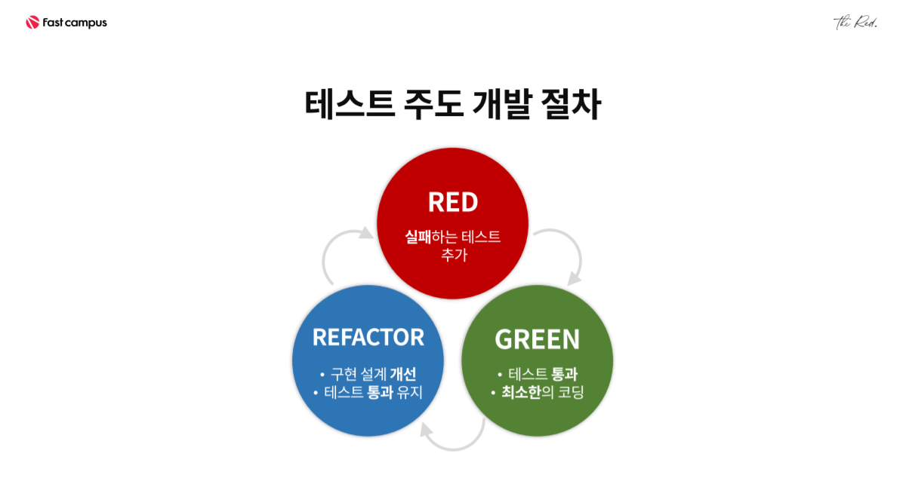
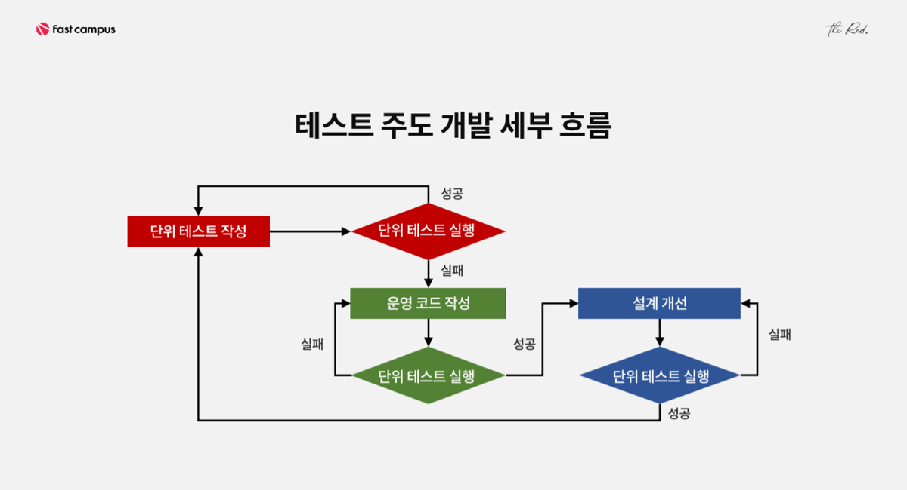

# 구름톤 유니브 연합 스터디 백엔드 1차 과제


이번 과제는 **TDD(Test-Driven Development)** 방식을 활용하여 시스템을 구축하는 것입니다.

### 1. TDD 에 대한 이해

- TDD란?


> 테스트 주도 개발 절차를 이르는 말.  
> 먼저 실패하는 테스트를 추가하고 (RED)  
> 해당 테스트를 추가하는 코드를 작성한다. (GREEN)  
> 최종적으로 테스트에 성공한 코드를 리팩토링한다. (REFACTOR)


- TDD는 언제, 왜 필요한가?

>**WHEN**   : 실제 개발 코드를 작성하기 이전에  
>**WHY**    :
> 1. 코드의 불안정성을 해결하고
> 2. 오버엔지니어링을 방지하며
> 3. 개발의 인과관계를 쉽게 확인할 수 있기 때문이다!


### 2. 수강신청 서비스 구현

2024년 2학기, 미르미 대학교의 수강신청 시스템 개발을 맡은 당신은 매 학기마다 반복되는 **수강신청 전쟁**을 해결해야 합니다. 이번 과제는 단순한 개발이 아니라, **TDD(Test-Driven Development)** 방식을 활용하여 시스템을 구축하는 것입니다.

### 🥅 **과제 목표**

- **테스트 주도 개발(TDD)** 방식을 적용하여 수강신청 관리 시스템의 회원가입 및 로그인 서비스를 개발한다.

### **필수 구현 사항**

1. **회원 가입 및 로그인 기능 구현(1차 과제)**
    - 학생 및 관리자 계정을 위한 회원 가입 및 로그인 기능
    - 로그인한 사용자만 수강신청 기능을 이용할 수 있도록 설정

2차 과제의 필수 구현 사항은 다음과 같습니다. 2차 과제 내용을 고려하여 1차 과제를 수행해주세요!

1. **수강신청 기능 구현(2차 과제)**
    - 학생이 수강신청을 추가할 수 있는 기능 구현
    - 학생이 수강신청을 취소할 수 있는 기능 구현
    - 학생이 자신의 수강신청 목록을 조회할 수 있는 기능 구현
2. **강좌 목록 조회 기능 구현(2차 과제)**
    - 관리자 또는 학생이 강좌 목록을 조회할 수 있는 기능 구현
    - 강좌 상세 정보 조회 기능 구현

### 설계

회원 설계 가이드 예시

- 회원
    - id
    - password
    - created_at
    - type(학생, 관리자)

### 3. 나의 이해와 의견

- 2번 과제에 TDD를 적용하여 구현하며 느낀 TDD에 대한 자신의 생각 요약
1. 예시: 각 기능을 TDD 방식으로 개발하면서 어떤 테스트를 먼저 작성했는지, 그리고 해당 테스트를 통과하기 위해 어떤 코드를 작성했는지에 대한 설명을 포함하세요. 리팩토링 과정에서의 고민도 함께 설명해 주세요!
- 의외의 의견을 자유롭게 남겨주세요.

## 과제 제출 예시

ISSUE 제목: [1차] 이름 과제 제출합니다.

```jsx
## 1. TDD 에 대한 이해
> 다음 문항에 대한 내용을 조사한 후 정리하여 채워주세요!
- TDD란?
- TDD는 언제 필요할까? 왜 필요한가?

## 2. 수강신청 서비스 구현
### **필수 구현 사항**
1. **회원 가입 및 로그인 기능 구현(1차 과제)**
    - 학생 및 관리자 계정을 위한 회원 가입 및 로그인 기능
    - 로그인한 사용자만 수강신청 기능을 이용할 수 있도록 설정

> 본인 레포에서 public으로 구현 후 레포 주소를 올려주세요!

2차 과제의 필수 구현 사항은 다음과 같습니다. 2차 과제 내용을 고려하여 1차 과제를 수행해주세요!
1. **수강신청 기능 구현(2차 과제)**
    - 학생이 수강신청을 추가할 수 있는 기능 구현
    - 학생이 수강신청을 취소할 수 있는 기능 구현
    - 학생이 자신의 수강신청 목록을 조회할 수 있는 기능 구현
2. **강좌 목록 조회 기능 구현(2차 과제)**
    - 관리자 또는 학생이 강좌 목록을 조회할 수 있는 기능 구현
    - 강좌 상세 정보 조회 기능 구현

## 3. 나의 이해와 의견
> 2번 과제에서 TDD를 적용하여 구현하며 느낀 자신의 생각을 요약하여 작성하세요!
내용 예시: 각 기능을 TDD 방식으로 개발하면서 어떤 테스트를 먼저 작성했는지, 그리고 해당 테스트를 통과하기 위해 어떤 코드를 작성했는지에 대한 설명을 포함하세요. 리팩토링 과정에서의 고민도 함께 설명해 주세요!
- 의외의 의견도 자유롭게 남겨주세요.

```